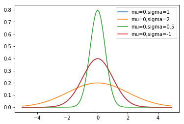

## Content 
### friends.py 
### normal_df.py 
### cmpe-255-lab2.ipynb 

## Part 1 
### Sample output
```
dataset: [100, 49, 41, 40, 25, 10, 5, 4, 7, 20, 60]
mean= 32.81818181818182 
median = 25
```
## Part 2
###Plot normal_df.py


  
